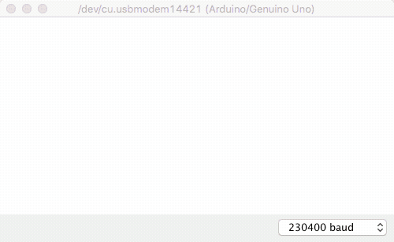

# arduino-hertz
Measure amplitude and frequency of vibrations using an Arduino Uno with an LIS3DH accelerometer/sensor

- Uses a simple and fast zero crossing detection algorithm to estimate frequency.
- Outputs amplitude and frequency for X, Y, Z axis respectively.
- Auto-calibrates against gravity/tilt zero and natural resonance in the first few seconds of program start.
- Plot frequency or amplitude
- Easily adjustable baud rate, sample size, sensitivity, calibration time, frequency or amplitude mode

### Demo (with real data)

- Plotting mode: amplitude
- First few seconds shows natural resonance being auto-calibrated.
- Blue=X, Red=Y, Green=Z

